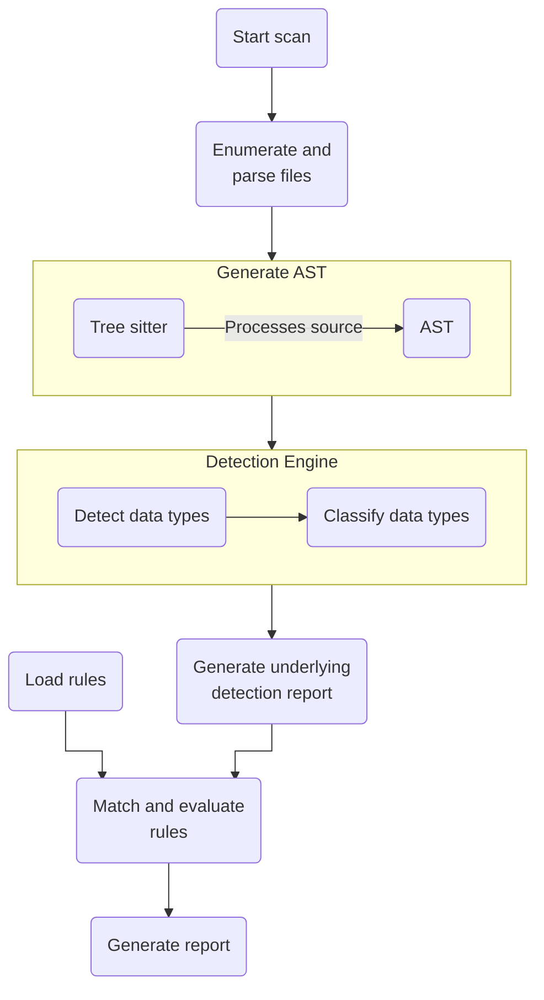

# Como ExKaliBurr funciona?

```mermaid
%%{ init: { 'flowchart': { 'curve': 'stepAfter' } } }%%
flowchart TB
    
    direction TB
    loadrule(Load rules) --> evalrule
    scan(Start scan) --> parse(Enumerate and\n parse files)
    parse --> AST
    AST --> DNC
    DNC --> df(Generate underlying \ndetection report)
    df --> evalrule(Match and evaluate \nrules)
    evalrule --> E(Generate report)
    
    subgraph AST[Generate AST]
    direction LR
    AST1(Tree sitter) --> |Processes source| AST2(AST)
    end
    

    subgraph DNC[Detection Engine]
    direction LR
    dd(Detect data types) --> cd(Classify data types)
    end
    
```
