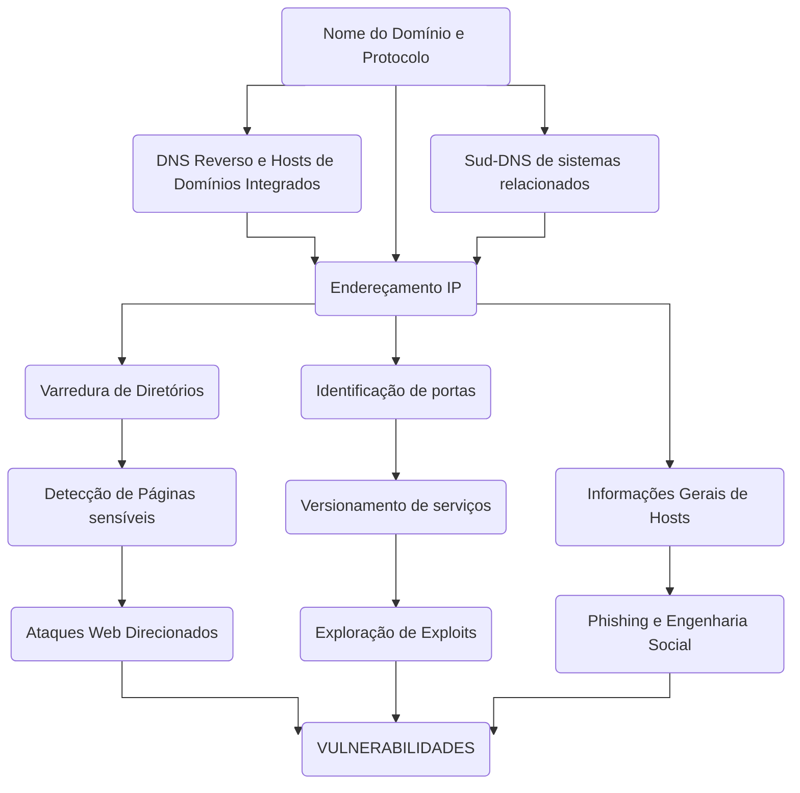

# Como ExKaliBurr funciona?

```mermaid

%%{ init: { 'flowchart': { 'curve': 'stepAfter' } } }%%
flowchart TB
    A(Nome do Domínio e Protocolo) --> B(DNS Reverso e Hosts de Domínios Integrados)
    B --> C(Endereçamento IP)
     A --> C
    A --> D(Sud-DNS de sistemas relacionados)
    D --> C
   C --> E(Identificação de portas)
   C --> F(Varredura de Diretórios)
   C --> H(Informações Gerais de Hosts)
   E --> I(Versionamento de serviços)
   F --> J(Detecção de Páginas sensíveis)
   H --> K(Phishing e Engenharia Social)
   I --> L(Exploração de Exploits)
   J --> M(Ataques Web Direcionados)
   M -->N(VULNERABILIDADES)
   L -->N
   K -->N
```
